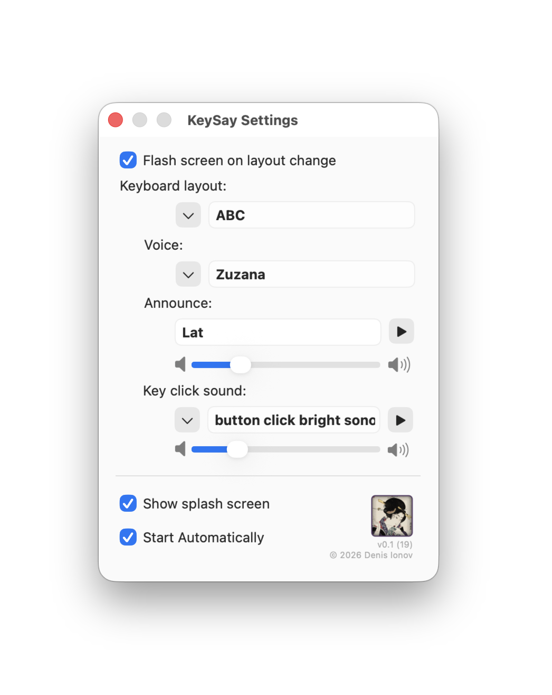

# KeySay

1. This app announces change of keyboard layout with Text To Speech and System Beep/Screen Flash (if screen flash enabled in system settings)
2. Also it reminds current keyboard layout after 10 seconds without kepresses
3. And also it play different keyclick sound for different keyboard layouts

## Use

Get latest Release here - it is signed and notarised.
Also available on Apple Mac App Store [Get it here](https://apps.apple.com/ru/app/keysay-key-clicker-and-more/id6802026223). App Store version will follow updates so you don't need to look for new releases here.

You'll need to enable Input Monitoring for KeySay (drag and drop application to app list in Settings->Privacy and Security->Input Monitor). App will ask you for this on launch, and open folder with KeySay.app in Finder and necessary page in Settings, so you can just drag and drop App in list and then enable Input Monitoring with switch on the right.

Settings and Quit available through menu bar item.

## Keisai Eisen

Keisai Eisen (渓斎 英泉, 1790–1848) was a Japanese ukiyo-e artist who specialised in bijin-ga (pictures of beautiful women). His best works, including his ōkubi-e ("large head pictures"), are considered to be masterpieces of the "decadent" Bunsei Era (1818–1830).
[More info on Wikipedia](https://en.wikipedia.org/wiki/Keisai_Eisen)
