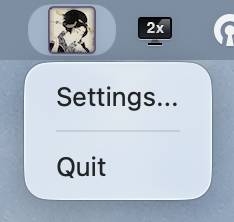
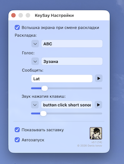

# KeySay

1. This app announces change of keyboard layout with Text To Speech and System Beep/Screen Flash (if screen flash enabled in system settings)
2. Also it reminds current keyboard layout after 10 seconds without kepresses
3. And also it play different keyclick sound for different keyboard layouts

## Use

Get latest Release - it is signed and notarised.

Settings and Quit available through menu bar item.

## Troubleshooting

- Restart KeySay after it added and enabled in the Privacy and Security -> Universal Access it is neccessary to play keyboard click sounds.

## Keisai Eisen

Keisai Eisen (渓斎 英泉, 1790–1848) was a Japanese ukiyo-e artist who specialised in bijin-ga (pictures of beautiful women). His best works, including his ōkubi-e ("large head pictures"), are considered to be masterpieces of the "decadent" Bunsei Era (1818–1830).
[More info on Wikipedia](https://en.wikipedia.org/wiki/Keisai_Eisen)
